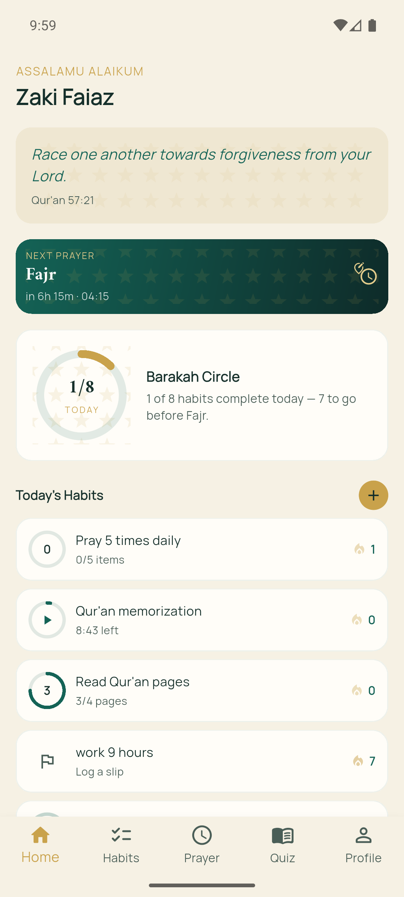
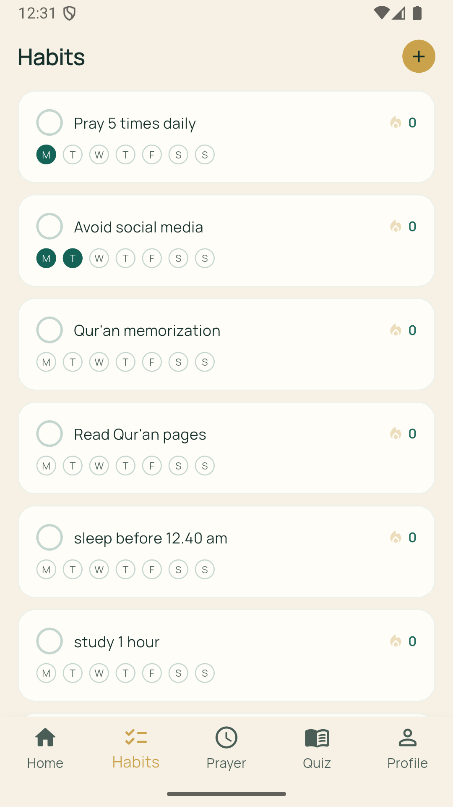
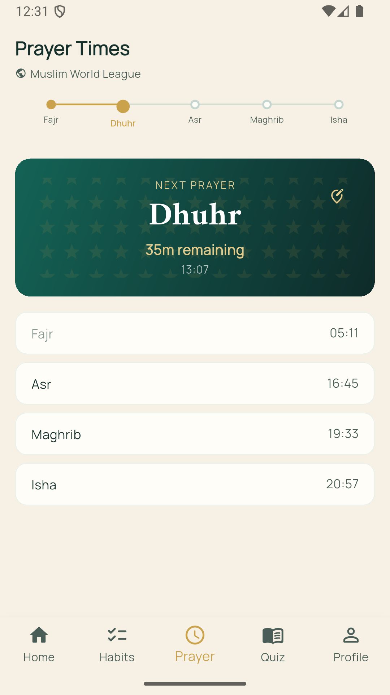
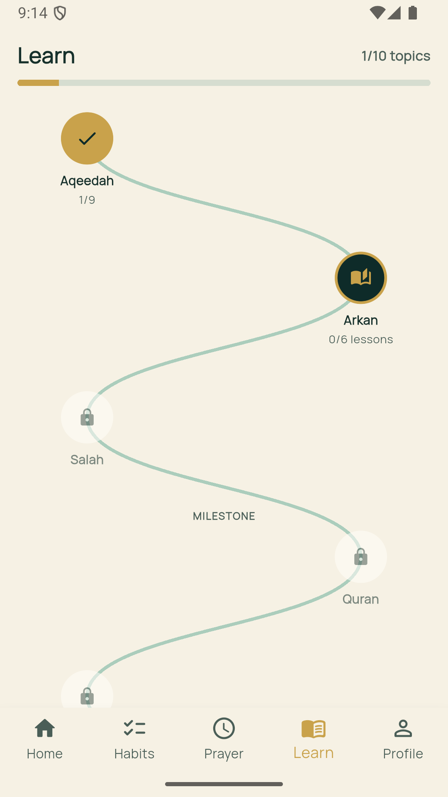
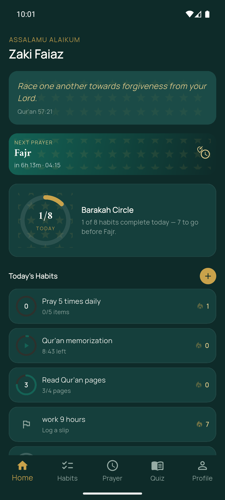
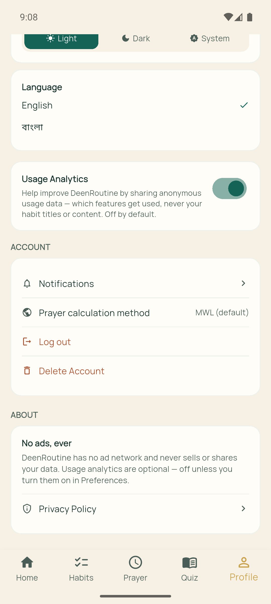

# DeenRoutine

**Habits & Spirituality Productivity Tracker**

DeenRoutine is a cross-platform mobile app that helps Muslims build consistency in both religious practice and personal development — in one place, instead of juggling a separate prayer app, a to-do list, and a Quran app. Habits sit alongside real, location-based prayer times, prayers can be tracked waqt by waqt, progress is visualized through the "Barakah Circle," and daily Quranic/Hadith content, an Islamic knowledge quiz, and Learn topics keep users engaged.

Built with Flutter and Firebase as an academic Master's (MIT) project at the Institute of Information & Communication Technology, Shahjalal University of Science & Technology — now being prepared for release on the Google Play Store.

## Features

- **Dual habit tracking** — manage Islamic habits (Salah, Qur'an recitation, Adhkar) and personal habits (exercise, reading, hydration) side by side, with daily, weekly, specific-weekday, or one-time scheduling, and starter templates to begin from.
- **Six tracking types** — simple yes/no, counts (e.g. 10 pages), timers, checklists, ratings, and avoidance habits where a clean day is the win.
- **Barakah Circle** — a real-time, custom-painted progress ring on the dashboard showing today's completion rate.
- **Prayer times** — the day's five prayer times by geolocation (or a manually picked city) via the Aladhan API, with a choice of calculation method and Asr school, cached in Firestore to minimize network calls. Optional adhan alarms per prayer.
- **Prayer tracking** — tick off each prayer; the app knows each waqt and records it as on time, late, or qada, with an "excused" state that pauses streaks without breaking them. Opt-in Android check-in notifications can log a prayer straight from the notification.
- **Prayer insights** — a private, collapsed-by-default Profile section with a five-prayer streak, per-prayer consistency, and a 30-day grid.
- **Daily motivation** — a rotating Quranic verse or Hadith on the dashboard (optionally as a daily notification), with up to five saved favourites.
- **Learn & quiz** — step-by-step Islamic knowledge topics with assessments, plus multiple-choice quizzes with instant scoring and history.
- **Streaks** — computed from completion logs, not stored as a raw counter, so history stays accurate.
- **Notifications** — habit reminders, a streak nudge, a Friday summary, and come-back messages, all scheduled locally on the device; each kind can be switched off on its own.
- **Light/dark theme & English/Bangla localization.**
- **Privacy** — no ads, opt-in-only analytics, and per-user data isolation enforced at the database layer via Firestore Security Rules. Accounts can be deleted in the app or on the web.

## Screenshots

<p float="left">
  
  
  
  
  
  
</p>

## Tech stack

| Layer | Technology |
| --- | --- |
| Frontend | Flutter (Dart ≥ 3.3.0) |
| State management | Provider (ChangeNotifier) |
| Backend | Firebase Authentication, Cloud Firestore, Firebase Analytics (opt-in only) |
| Prayer times | Aladhan REST API + Geolocator |
| Notifications | flutter_local_notifications (local scheduling, with notification actions), alarm (adhan playback) |
| Local persistence | SharedPreferences |

## Architecture

DeenRoutine follows a layered client-server architecture:

```
Screen (widget)  →  Provider (ChangeNotifier)  →  Service (Firebase/HTTP)  →  Model (toMap/fromMap)
```

- **Screens** read state via `context.watch` / `context.read` and contain no business logic.
- **Providers** hold UI state and expose typed errors (e.g. `HabitErrorType`), never localized strings directly.
- **Services** talk to Firebase/HTTP only — no Flutter imports, no `BuildContext`.
- **Models** are plain Dart classes with `toMap`/`fromMap` for Firestore serialization.

Firestore collections: `Users`, `Habits`, `HabitLogs`, `PrayerLogs`, `LearnProgress`, `QuizQuestions`, `QuizResults`, `DailyQuotes`, `PrayerCache`, `Notifications`, `Settings` — see `firestore.rules` for the full access model and `firestore.indexes.json` for the composite indexes.

## Getting started

### Prerequisites

- Flutter SDK (stable channel, Dart ≥ 3.3.0)
- A Firebase project with Authentication and Cloud Firestore enabled
- Android Studio / VS Code with the Flutter and Dart extensions

### Setup

```bash
# Clone the repo
git clone https://github.com/Zaki003/deenroutine.git
cd deenroutine

# Install dependencies
flutter pub get

# Regenerate localization files (also runs automatically on build)
flutter gen-l10n

# Run on a connected device or emulator
flutter run
```

You'll need your own `firebase_options.dart` (generated via `flutterfire configure`) and a Firebase project configured to match `firestore.rules` and `firestore.indexes.json`:

```bash
firebase deploy --only firestore:rules,firestore:indexes
```

### Content management

Quiz questions and daily quotes are edited as JSON and pushed to Firestore via Node scripts — not through the app or the Firebase console directly:

```bash
npm install
npm run seed:quiz      # push data/quiz_questions.json → QuizQuestions
npm run seed:quotes    # push data/daily_quotes.json → DailyQuotes
```

See [data/README.md](data/README.md) for the one-time service account setup and content-format rules.

### Useful commands

```bash
flutter analyze                                  # static analysis
flutter test test/prayer_waqt_test.dart test/prayer_stats_test.dart test/prayer_check_in_plan_test.dart
```

`test/widget_test.dart` is still the default `flutter create` boilerplate and fails as-is; the prayer-tracking tests above are the real suite so far.

## Roadmap

- iOS release and wider cross-device testing
- Push notifications via FCM (beyond local scheduling)
- Social/community habit challenges
- AI-assisted habit recommendations
- Richer habit analytics (weekly/monthly trends, like Prayer insights has for prayers)

## Academic context

DeenRoutine began as a Project II thesis at the Institute of Information & Communication Technology (IICT), Shahjalal University of Science & Technology, submitted by Zaki Faiaz Chowdhury (MIT – 07 Batch), supervised by Dr. M. Abdullah Al Mumin. The project report covers requirements analysis, system design, and testing.

## License

No license selected yet — all rights reserved by default until one is added.

## Contact

Built and maintained by Zaki Faiaz Chowdhury.
